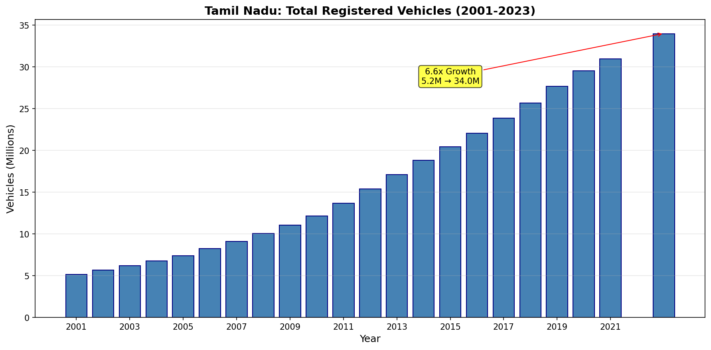
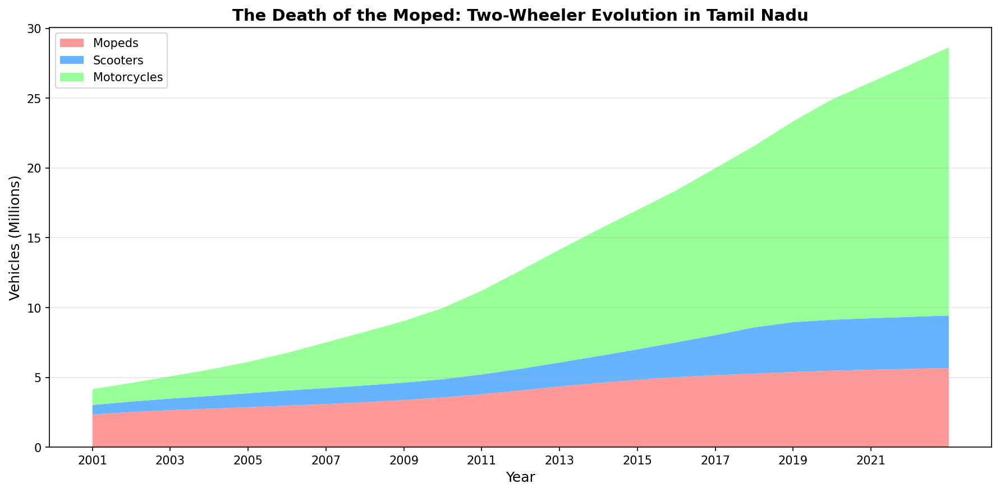
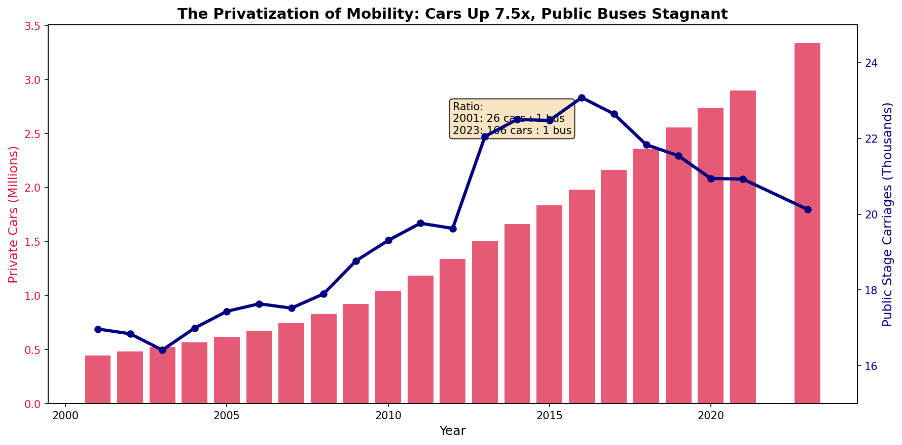
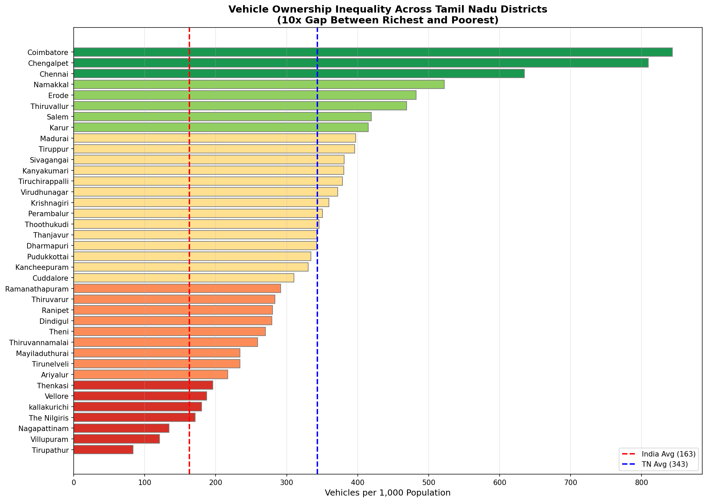
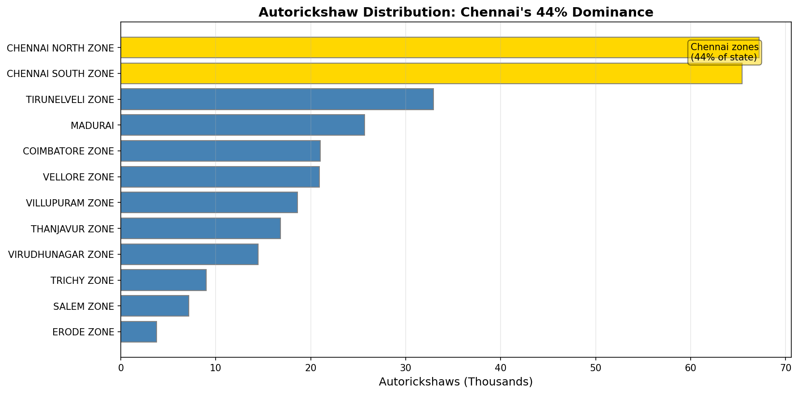
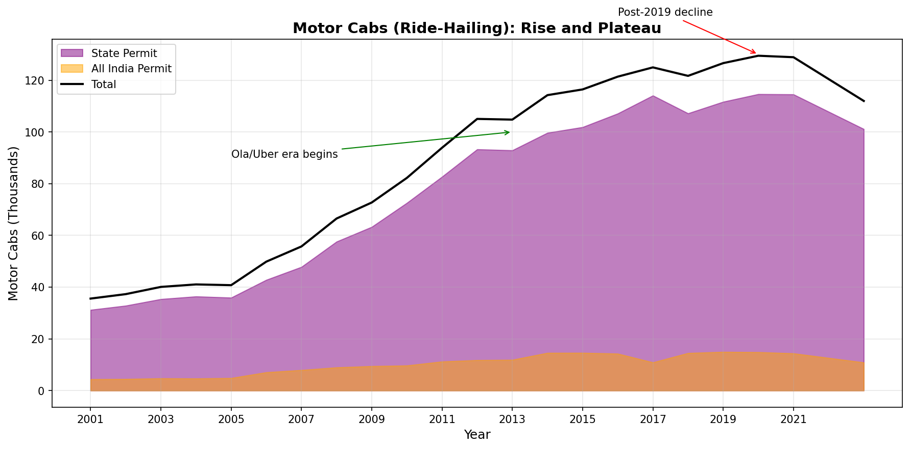
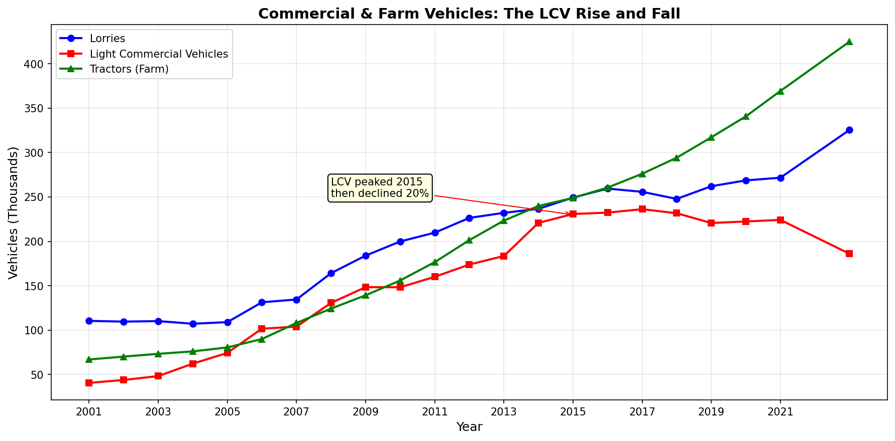
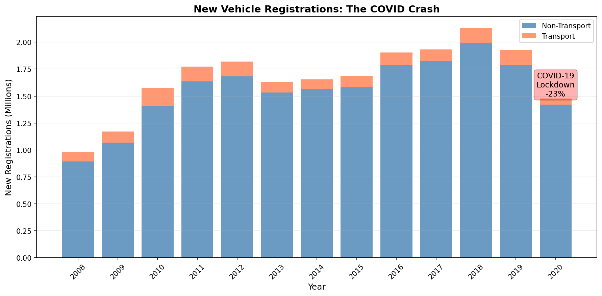

# The Road to Nowhere: How Tamil Nadu's 34 Million Vehicles Tell a Story of Privatized Mobility and Widening Inequality

## Executive Summary

**Top 3 Findings:**

1. **The Public Transit Betrayal**: While private cars grew 7.5x from 2001-2023 (to 3.3 million), public stage carriages barely moved from 17,000 to 20,000. The car-to-public-bus ratio exploded from 26:1 to 166:1—a systematic privatization of mobility that forces every family to buy vehicles.

2. **The 10x District Divide**: Coimbatore has 843 vehicles per 1,000 people while Tirupathur has just 84—a 10-fold gap revealing stark economic inequality written in steel and rubber. Tamil Nadu's average (343/1000) is 2x the national average (163), but this masks enormous internal disparities.

3. **The Moped's Death, The Motorcycle's Reign**: In 2001, mopeds (cheap, slow, simple) dominated Tamil Nadu's roads at 2.3 million versus 1.1 million motorcycles. By 2023, motorcycles exploded to 19.2 million while mopeds limped to 5.7 million—a 17x versus 2.4x growth that mirrors rising incomes and aspirations.

**Recommended Actions:**
- Urgently expand public transit—the state needs 3-5x more buses
- Investigate why rural/agricultural districts have such low vehicle access
- Monitor the ride-hailing decline and LCV contraction for economic signals

---

## The Investigation

### Chapter 1: A State That Moves on Two Wheels

> *"Tell me how a society moves, and I'll tell you who it is."*

Tamil Nadu has 34 million registered vehicles for a population of 77 million people—roughly one vehicle for every 2.3 people, including children. On the surface, this looks like prosperity. Dig deeper, and you find a transportation system built on forced privatization.

**84% of all vehicles are two-wheelers.** Not cars. Not buses. Motorcycles, scooters, and the dying breed of mopeds.

From 2001 to 2023, Tamil Nadu added 29 million vehicles—a 6.6x increase. The population grew barely 1.1x in the same period. Something else was happening: the state was building a transportation system one family purchase at a time.

### Chapter 2: The Moped's Requiem

In 2001, if you were a Tamil family that couldn't afford a motorcycle, you bought a moped—a simple, cheap machine that got you 10 kilometers to work. Mopeds outnumbered motorcycles 2:1.

Then came rising incomes, cheaper financing, and a cultural shift toward "real" motorcycles.

**The numbers tell the story:**
| Year | Motorcycles | Mopeds | Motorcycle Share |
|------|-------------|--------|------------------|
| 2001 | 1.14M | 2.34M | 32.8% |
| 2010 | 5.10M | 3.56M | 51.2% |
| 2023 | 19.21M | 5.66M | 77.2% |

Motorcycles grew 17x. Mopeds grew 2.4x.

This isn't just a vehicle preference—it's an economic story. As Tamil families moved from poverty to lower-middle-class, they upgraded their wheels. The moped became a marker of the past, something your grandfather rode.

**But wait—what about those who can't afford motorcycles?**

They're still buying mopeds. The 5.7 million mopeds still on the road represent families who haven't yet crossed the economic threshold. They're concentrated in agricultural districts, in smaller towns, among older populations.

### Chapter 3: The Privatization of Mobility

Here's the finding that should make every transportation planner uncomfortable:

**In 2001, there were 26 private cars for every public stage carriage (bus).
In 2023, there are 166 private cars for every public bus.**

Private cars grew from 447,000 to 3.34 million—a 7.5x increase.

Public stage carriages went from 16,969 to 20,127—an 18% increase over *twenty-two years*.

This is not natural market evolution. This is a policy failure. When public transit doesn't expand, people are forced to buy private vehicles. Every motorcycle purchase represents a family that couldn't wait for a bus that never came.

**The school bus explosion confirms this:** School buses grew 16x (from 2,141 to 34,835) because the government didn't build enough public transit, forcing schools to fill the gap. Parents had to either buy vehicles or pay for private school transport.

### Chapter 4: The Geography of Inequality

Tamil Nadu's 38 districts don't share equally in this vehicle boom. The gap is shocking.

| Rank | District | Vehicles per 1,000 | Character |
|------|----------|-------------------|-----------|
| 1 | Coimbatore | 843 | Industrial, wealthy |
| 2 | Chengalpet | 809 | Chennai suburb, IT |
| 3 | Chennai | 635 | State capital |
| 4 | Namakkal | 522 | Transport hub |
| 5 | Erode | 482 | Textile industry |
| ... | ... | ... | ... |
| 36 | Nagapattinam | 134 | Delta, agricultural |
| 37 | Villupuram | 121 | Rural, backward |
| 38 | Tirupathur | 84 | Newly carved, rural |

**The pattern is stark:**
- **Industrial districts** (Coimbatore, Tiruppur, Erode, Salem, Namakkal): Average 550 vehicles per 1,000
- **Agricultural districts** (Thiruvarur, Nagapattinam, Villupuram, Ariyalur): Average 213 vehicles per 1,000

Industrial areas have **2.6x more vehicles per capita** than agricultural areas.

This isn't just about wealth—it's about mobility poverty. In Tirupathur, with 84 vehicles per 1,000 people, most families don't have any motorized transport. They walk, they wait for infrequent buses, they depend on others. In Coimbatore, with 843 per 1,000, every adult has access to a vehicle.

**Comparison to national average:**
- India average: 163 vehicles per 1,000
- Tamil Nadu average: 343 vehicles per 1,000 (2.1x national)
- Coimbatore: 843 per 1,000 (5.2x national)
- Tirupathur: 84 per 1,000 (0.5x national)

### Chapter 5: The Trucking Geography

Salem and Namakkal have a secret: they're Tamil Nadu's trucking powerhouses.

**Salem district has more National Permit lorries (20,734) than total lorries registered (19,332).**

Wait—how can you have more inter-state permits than total trucks? Because trucks registered elsewhere come to Salem to get their national permits. Salem sits at the intersection of major highways connecting Tamil Nadu to Karnataka, Kerala, and Andhra Pradesh.

| District | National Permit Lorries | All Lorries | NP Ratio |
|----------|------------------------|-------------|----------|
| Salem | 20,734 | 19,332 | 107% |
| Vellore | 3,206 | 4,166 | 77% |
| Thanjavur | 3,377 | 5,776 | 58% |
| Namakkal | 12,329 | 23,186 | 53% |

High NP ratios indicate **interstate trade hubs**—districts whose economies depend on goods flowing across state borders.

### Chapter 6: The Autorickshaw Empire of Chennai

Chennai's two transport zones have 132,647 autorickshaws—**44% of the entire state's fleet**—despite having just 10% of the population.

This concentration tells us:
1. Chennai's public transit (metro, buses) is insufficient
2. Last-mile connectivity in the capital depends almost entirely on autos
3. Outside Chennai, people rely more on personal vehicles or simply don't travel

The disparity is jarring: Chennai has 67,000+ autos per zone, while Salem (a major city) has just 7,165 for the entire zone.

### Chapter 7: The Ride-Hailing Rise and Fall

Motor cabs (the category that includes Ola and Uber vehicles) tell an interesting story:

- 2001: 36,000 motor cabs
- 2015: 120,000 motor cabs (Ola founded 2010, Uber India 2013)
- 2019: 134,000 motor cabs (peak)
- 2023: 115,000 motor cabs

**Post-2019 decline of 14%**. This could indicate:
- Market saturation
- Drivers leaving the platform economy
- COVID aftermath
- Regulatory challenges

This needs monitoring. If ride-hailing is contracting, it could force more vehicle purchases.

### Chapter 8: The LCV Mystery

Light Commercial Vehicles (LCVs)—the Tata Aces and Mahindra Boleros of last-mile delivery—show a puzzling pattern:

| Year | LCVs | Share of Goods Vehicles |
|------|------|------------------------|
| 2001 | 40,598 | 25% |
| 2010 | 148,249 | 42% |
| 2015 | 230,717 | 48% |
| 2023 | 185,962 | 35% |

LCVs peaked in 2015 and have since declined by 20%.

**Why would last-mile delivery vehicles decline in the age of e-commerce?**

Possible explanations:
1. Consolidation in logistics (fewer, larger fleets)
2. Shift to three-wheeler cargo vehicles
3. Platform-based delivery using existing vehicles
4. Economic stress in small transport operators

This deserves deeper investigation—it could signal structural changes in how goods move in Tamil Nadu.

### Chapter 9: The COVID Crash

2020-21 saw new registrations crash 23%—from 1.92 million to 1.48 million. Transport vehicle registrations fell 59% (from 138,000 to 57,000).

This wasn't just reduced demand—it was an economic crisis. Fewer new buses, fewer new trucks, fewer taxis. The recovery data (2021-2023) isn't in our dataset, but tracking this recovery is crucial.

### Chapter 10: The Ambulance Inequality

A disturbing finding: ambulance coverage varies **10x across districts**.

| District | Ambulances | Population | Per Lakh |
|----------|------------|------------|----------|
| Thiruvallur | 2,077 | 3.8M | 54.7 |
| Chengalpet | 1,377 | 2.6M | 53.0 |
| Coimbatore | 899 | 3.8M | 23.7 |
| Chennai | 1,613 | 7.6M | 21.2 |
| Dindigul | 254 | 2.2M | 11.5 |

Thiruvallur has 54.7 ambulances per lakh people; Dindigul has 11.5. A heart attack in Thiruvallur has 5x better odds of getting an ambulance quickly.

This is a **life-or-death inequality** hidden in vehicle registration data.

---

## Data & Methods

### Sources
- **Primary**: [OpenCity Urban Data Portal](https://data.opencity.in/dataset/tamil-nadu-vehicles-registration-data)
- **Cross-reference**: [Data.gov.in](https://www.data.gov.in), [Parivahan Portal](https://vahan.parivahan.gov.in)
- **Population**: Census 2011 projections to 2023

### Datasets Used
| File | Description | Period |
|------|-------------|--------|
| tn-vehicular-position-2001-2023.csv | Stock of vehicles by category | 2001-2023 |
| tn-newly-registered-2008-21.csv | New registrations by type | 2008-2021 |
| tn-commercial-vehicles-distwise-2023.csv | Commercial vehicles by district | 2023 |
| tn-non-commercial-vehicles-distwise-2023.csv | Private vehicles by district | 2023 |
| tn-autorickshaws-2023.csv | Autorickshaws by zone | 2023 |

### Limitations
1. **Aggregate data only**: Individual vehicle records not publicly available
2. **No fuel type breakdown**: EV penetration cannot be analyzed
3. **Population estimates**: 2023 population based on 2011 Census projections
4. **2022 gap**: No data available for 2022
5. **Registration vs. active vehicles**: Scrapped vehicles may still be in registrations

### Confidence Levels
- Total vehicle counts: **High** (official government data)
- Per-capita calculations: **Medium** (population estimates)
- Year-over-year trends: **High** (consistent methodology)
- Inter-district comparisons: **Medium-High** (district boundaries changed)

---

## Appendix: Key Statistics

### State Summary (March 2023)
| Metric | Value |
|--------|-------|
| Total Vehicles | 33,972,067 |
| Two-Wheelers | 28,643,234 (84.3%) |
| Cars | 3,339,866 (9.8%) |
| Commercial Vehicles | 1,336,372 (3.9%) |
| Vehicles per 1000 population | 343 |
| 22-Year Growth (2001-2023) | 6.6x |
| CAGR (2001-2023) | 8.9% |

### Growth Rates by Period
| Period | CAGR |
|--------|------|
| 2001-2005 | 9.4% |
| 2005-2010 | 10.4% |
| 2010-2015 | 10.9% |
| 2015-2020 | 7.6% |
| 2020-2023 | 4.8% |

### Vehicle Category Growth (2001-2023)
| Category | 2001 | 2023 | Growth |
|----------|------|------|--------|
| Motorcycles | 1.14M | 19.21M | 16.8x |
| School Buses | 2,141 | 34,835 | 16.3x |
| Motor Cars | 0.45M | 3.34M | 7.5x |
| Tractors | 67K | 425K | 6.3x |
| Scooters | 0.68M | 3.77M | 5.5x |
| Lorries | 110K | 325K | 2.9x |
| Autorickshaws | 108K | 303K | 2.8x |
| Mopeds | 2.34M | 5.66M | 2.4x |
| Public Buses | 16,969 | 20,127 | 1.2x |

---

## Visualizations

All visualizations are available in the `visualizations/` folder:
- `01_total_vehicles_growth.png` - 22-year growth trajectory
- `02_twowheeler_evolution.png` - Moped vs Motorcycle shift
- `03_cars_vs_buses.png` - Private vs Public mobility
- `04_district_inequality.png` - Geographic ownership disparity
- `05_goods_vehicles.png` - Commercial vehicle trends
- `06_new_registrations.png` - COVID impact on sales
- `07_autorickshaw_zones.png` - Chennai's auto dominance
- `08_motor_cabs.png` - Ride-hailing trajectory

---

*Analysis conducted November 2025. Data sourced from Tamil Nadu Transport Department via OpenCity.in.*
